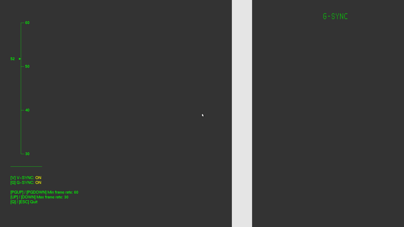
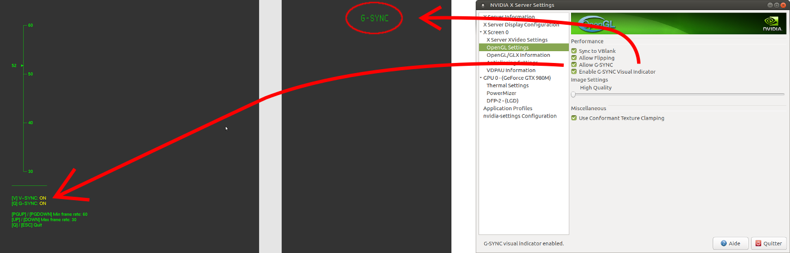

# Unofficial OpenGL G-SYNC Demo for Linux

This is a very basic OpenGL demo for testing NVIDIA's G-SYNC technology on Linux.

The demo simply draws a vertical bar moving accross the screen at constant speed,
but deliberately rendered at a variable frame rate.

The min and max frame rates can be manually changed at runtime, by step of 10 fps
and with a min of 10 fps.

The demo also allows to toggle V-Sync on/off. Here are the expected effects:

| G-SYNC | V-Sync | Effects
|:------:|:------:|--------
|   ON   |   ON   | No tearing, no stuttering unless frame rate is too low (30 fps or less)
|   ON   |   OFF  | No tearing below monitor's refresh rate, tearing above, no stuttering
|   OFF  |   ON   | No tearing but stuttering below monitor's refresh rate
|   OFF  |   OFF  | Tearing, stuttering below monitor's refresh rate



## Warning: possible side effects on your system's setup

At runtime, the demo modifies two global parameters of your NVIDIA's settings:

* The "Allow G-SYNC" parameter (which can be controlled by the user during the demo)
* The G-SYNC visual indicator (forced to be enabled at demo startup)

Those parameters are reset to their initial value when the demo exits normally.
In case of an abnormal exit (process crashed or get killed), you should check your
settings to ensure they have the values you want.



## Installation

The package is available for Arch Linux in the [AUR](https://aur.archlinux.org/packages/gl-gsync-demo/)

## Dependencies

The demo is written in C99 and uses the legacy OpenGL 1.x API and requires the
following libraries:

* [FreeGLUT](http://freeglut.sourceforge.net/)
* [GLEW](http://glew.sourceforge.net/)
* libXNVCTRL (from [nvidia-settings](https://github.com/NVIDIA/nvidia-settings))

On Ubuntu, you can install dependencies with the following command:

```
sudo apt install freeglut3-dev libglew-dev libxnvctrl-dev
```

You will also need NVIDIA's proprietary driver and its development files installed.

## Build instructions

In project's root directory, type:

``
make
``

After building, you can run the demo by typing:

``
./gl-gsync-demo
``

## License

See the [LICENSE](LICENSE) file for license rights and limitations (MIT).
